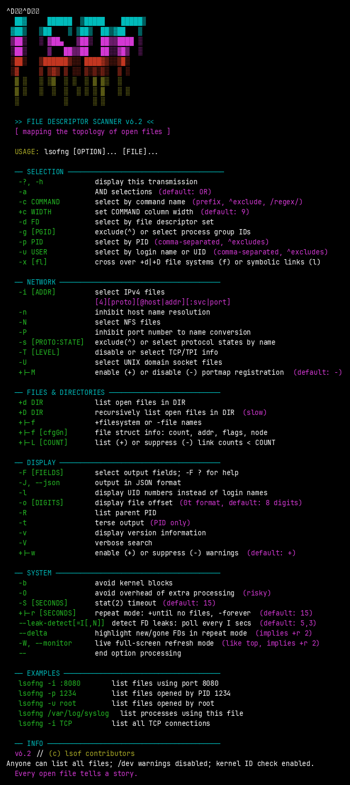
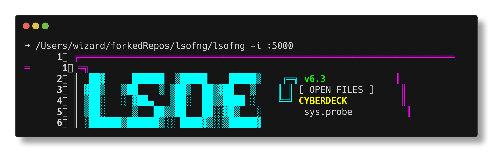
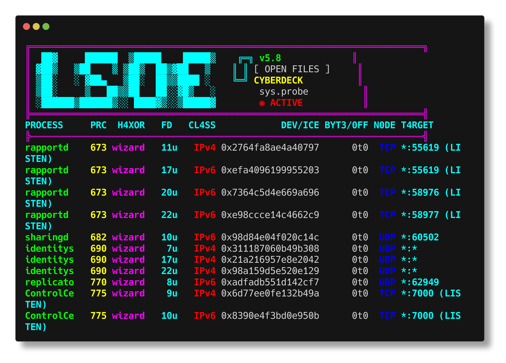
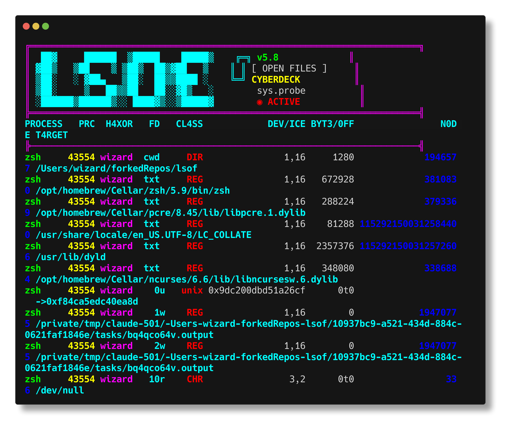
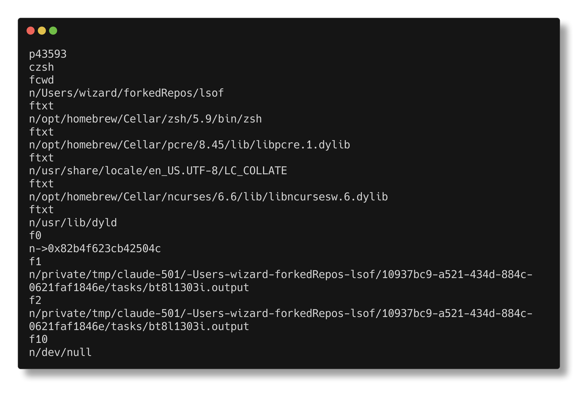
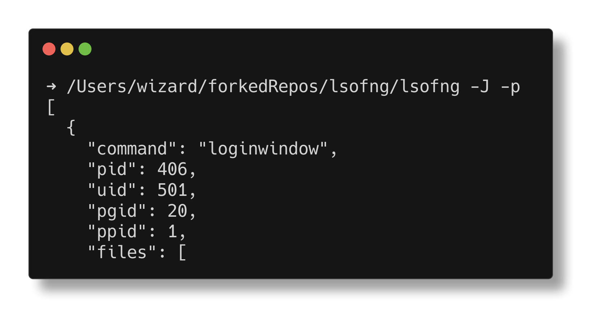
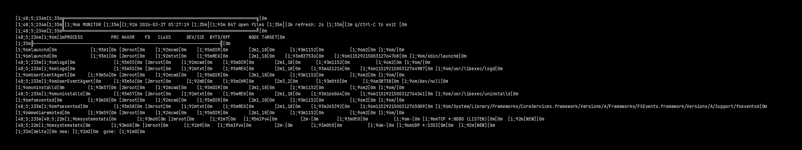
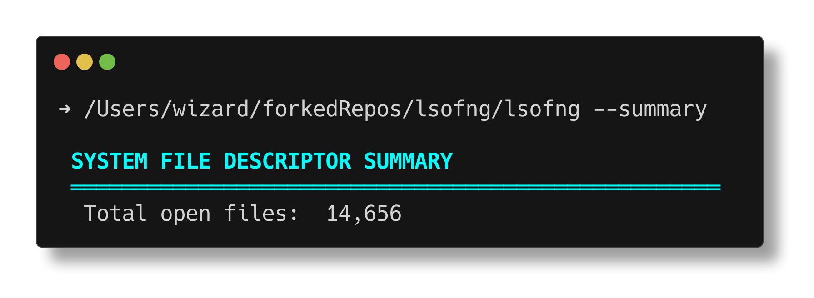
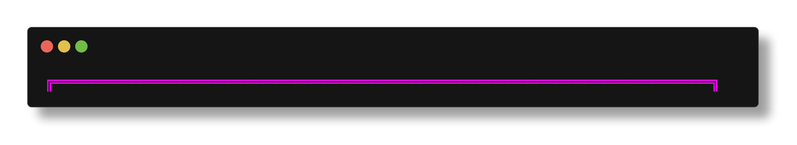

```
 ██▓      ██████  ▒█████    █████▒
▓██▒    ▒██    ▒ ▒██▒  ██▒▓██   ▒
▒██░    ░ ▓██▄   ▒██░  ██▒▒████ ░
▒██░      ▒   ██▒▒██   ██░░▓█▒  ░
░██████▒▒██████▒▒░ ████▓▒░░▒█░
░ ▒░▓  ░▒ ▒▓▒ ▒ ░░ ▒░▒░▒░  ▒ ░
░ ░ ▒  ░░ ░▒  ░ ░  ░ ▒ ▒░  ░
  ░ ░  ░ ░  ░    ░ ░ ░ ▒   ░ ░
    ░        ░        ░ ░
```

> **DEPRECATED** — This project is no longer maintained. See [lsofrs](https://github.com/MenkeTechnologies/lsofrs), a modern Rust rewrite.

> *"In the sprawl of running processes, every open file is a signal. Every socket, a wire in the dark."*

---

## // WHAT IS THIS

**lsof** — **L**ist **S**ystem **O**pen **F**iles — v6.3

A diagnostic tool forged in the UNIX underground. It maps the invisible topology between processes and the files they hold open: regular files, directories, sockets, pipes, devices, streams — anything the kernel touches.

If a process has a file descriptor, `lsof` sees it.

---

## // JACK IN — BUILD FROM SOURCE

### > CMake (recommended)

```bash
mkdir build && cd build
cmake ..
make
sudo make install
```

Installs to `/usr/local/sbin/lsof` by default. To change the prefix:

```bash
cmake -DCMAKE_INSTALL_PREFIX=/usr ..
```

---

## // SUPPORTED DIALECTS

lsof interfaces directly with kernel data structures. Each target OS is a **dialect** — a bespoke adapter wired into the machine layer.

| Dialect | Platform |
|---|---|
| `linux` | Linux |
| `darwin/libproc` | Apple macOS / Darwin |
| `freebsd` | FreeBSD |
| `n+obsd` | NetBSD / OpenBSD |
| `n+os` | NEXTSTEP / OpenStep |
| `sun` | Solaris / SunOS |
| `aix` | IBM AIX |
| `du` | DEC/Compaq/HP Tru64 UNIX (Digital UNIX) |
| `hpux/pstat` | HP-UX |
| `osr` | SCO OpenServer |
| `uw` | SCO UnixWare |

---

## // QUICKSTART — RUN IT

```bash
# List all open files
lsof

# Who's holding port 8080?
lsof -i :8080

# What files does PID 1337 have open?
lsof -p 1337

# All network connections — TCP & UDP
lsof -i

# Find who's using a specific file
lsof /var/log/syslog

# Trace a user's open files
lsof -u neo

# JSON output — pipe to jq, scripts, dashboards
lsofng -J -p 1337

# Detect FD leaks — poll every 5s, flag after 3 increases
lsofng --leak-detect
lsofng --leak-detect=10,5

# Live monitor — full-screen refresh like top(1)
lsofng --monitor
lsofng -W -i              # watch network connections live
lsofng -W --delta -p $$   # monitor with new/gone highlighting

# Aggregate FD summary — type breakdown, top processes, per-user
lsofng --summary
lsofng --stats -i          # summary of network connections only
lsofng --summary -J        # JSON summary output

# Follow a single process — watch FD opens/closes in real-time
lsofng --follow 1234
lsofng --follow=$PID
```

---

## // SCREENSHOTS

### > Help screen (`lsof -h`)



### > Port query (`lsof -i :5000`)



### > Network connections (`lsof -i -n -P`)



### > Process file listing (`lsof -p <PID>`)



### > Field output — machine-readable mode (`lsof -F pcfn`)



### > JSON output (`lsofng -J`)



### > Monitor mode (`lsofng --monitor`)



### > Summary mode (`lsofng --summary`)



### > Follow mode (`lsofng --follow PID`)



---

## // PERFORMANCE

The core engine is tuned for speed where it matters:

- **Fast text region enumeration**: uses `PROC_PIDREGIONPATHINFO2` (flavor 22) on Darwin, which returns only unique text file regions instead of every memory mapping — **330x fewer syscalls** than the legacy `PROC_PIDREGIONPATHINFO` API, dropping `process_text()` from ~22s to ~0.07s and matching Apple's system lsof
- **Compiler optimization**: `-O2` on all targets
- **Lookup tables**: character classification via precomputed `explen[]`, `printable[]`, `cls[]`, and `hv[]` tables — up to **97x** faster than per-character library calls
- **Binary search**: PID and PGID selection lists are sorted at entry and searched via O(log n) binary search — **2.4x** faster at 100 entries, **10x** at 1000
- **Manual formatting**: field output and path construction bypass `snprintf` for **9–15x** throughput
- **Hash tables**: port cache, host cache, device lookup, and file name matching all use power-of-2 hash tables with polynomial hashing

Run `make bench` or `./bench/run_benchmarks.sh` to see all benchmarks on your hardware. Target a specific suite with `./bench/run_benchmarks.sh hash`.

---

## // ARCHITECTURE

```
src/
├── *.c              # Core engine — command-line parser, output formatter,
│                      process walker, and file examiner
├── lib/             # Shared library modules (name cache, device cache, regex, etc.)
└── dialects/        # Per-OS kernel interface adapters
    ├── linux/
    ├── darwin/libproc/
    ├── freebsd/
    ├── n+obsd/
    ├── n+os/
    ├── sun/
    ├── aix/
    ├── du/
    ├── hpux/pstat/
    ├── osr/
    └── uw/
test/                # Unit and integration test suites
bench/               # Performance benchmarks
```

Each dialect provides three key headers — `machine.h`, `dlsof.h`, `dproto.h` — that wire the core engine into the target OS kernel.

---

## // FIELD OUTPUT — MACHINE-READABLE MODE

```bash
# Emit parseable field output
lsof -F pcfn

# Fields: p=PID, c=command, f=fd, n=name
# Pipe it. Parse it. Automate it.
```

## // JSON OUTPUT

```bash
# Structured JSON array — one object per process, nested files array
lsofng -J -p $$
lsofng --json -i :8080

# Pipe to jq for filtering
lsofng -J | jq '.[].files[] | select(.type == "IPv4")'
```

## // FD LEAK DETECTION

```bash
# Monitor all processes for file descriptor leaks
# Polls every 5 seconds, flags after 3 consecutive FD count increases
lsofng --leak-detect

# Custom interval (10s) and threshold (5 increases)
lsofng --leak-detect=10,5

# Combine with PID filter
lsofng --leak-detect -p 1234
```

---

## // MONITOR MODE

Live full-screen refresh mode — like `top(1)` for open files. Uses the ANSI alternate screen buffer for flicker-free updates that redraw in place.

```bash
# Watch all open files, refreshing every 2 seconds
lsofng --monitor
lsofng -W

# Monitor network connections live
lsofng -W -i

# Monitor with delta highlighting (new/gone FDs colored)
lsofng -W --delta

# Watch a specific process with custom refresh interval
lsofng -W -r 5 -p 1234

# Combine with any filter
lsofng -W -u neo -i :8080
```

**Features:**
- Flicker-free full-screen redraw using alternate screen buffer
- Status bar with timestamp, file count, and refresh interval
- Automatic terminal resize handling (SIGWINCH)
- Row truncation to fit terminal height
- Clean terminal restore on Ctrl-C
- Composable with `--delta`, `-i`, `-p`, `-c`, `-u`, and all other filters

**Interactive controls** (new in v6.3):
- `s` — cycle sort column (PID, COMMAND, USER, FDs)
- `r` — reverse sort order
- `f` — filter by file type (e.g. "REG", "SOCK")
- `/` — search/highlight by name substring
- `p` — pause/unpause refresh
- `?`/`h` — toggle help bar
- `q` — quit

**Requires a terminal** — exits with an error if stdout is not a TTY. Incompatible with `-J` (JSON), `-F` (field output), and `-t` (terse mode).

---

## // SUMMARY MODE

Aggregate system health snapshot — type breakdown with bar chart, top processes by FD count, and per-user totals.

```bash
# Full system summary
lsofng --summary
lsofng --stats           # alias

# Summary of network connections only
lsofng --summary -i

# Summary for a specific user
lsofng --stats -u neo

# JSON summary output — pipe to jq or monitoring systems
lsofng --summary -J
lsofng --summary -J -i | jq '.summary.types'
```

**Features:**
- Per-type FD breakdown with bar chart and percentages
- Top 10 processes ranked by open FD count
- Per-user totals (process count and file count)
- Supports all existing filter flags (`-c`, `-u`, `-p`, `-i`, etc.)
- JSON output via `-J` for programmatic consumption

---

## // FOLLOW MODE

Continuously watch a single process's file descriptors, highlighting opens and closes in real-time.

```bash
# Watch PID 1234
lsofng --follow 1234
lsofng --follow=$PID

# Default refresh: 1 second, custom:
lsofng --follow 1234 -r 5
```

**Features:**
- Real-time FD tracking with status highlighting:
  - `+NEW` (green) — newly opened file descriptors
  - `-DEL` (red) — recently closed file descriptors
- Full-screen alternate buffer (like `--monitor`)
- Interactive quit with `q`
- Useful for debugging file descriptor leaks during development

**Requires a terminal** — exits with an error if stdout is not a TTY.

---

## // TESTING

lsof ships with a unit test suite and an integration test suite. Run them with:

```bash
make check
```

This builds and executes `check_unit` and `check_integration`, writing results to `check_unit.log` and `check_integration.log` in the build directory.

### Unit tests (`test/test_unit.c`)

Tests core algorithms in isolation — no kernel access or lsof binary required:

- **Field ID constants** — uniqueness, sequential indices, correct character mappings, printable ASCII validation, name string verification, total count
- **x2dev()** — hex string to device number conversion (prefix handling, delimiters, edge cases, leading zeros, boundary values, null terminators)
- **HASHPORT** — port hash macro range, distribution, determinism, adjacent port divergence, max port, common port validation
- **safestrlen()** — safe string length with unprintable character expansion, full printable ASCII range, multiple control chars, mixed content
- **compdev()** — device table comparator, qsort integration, null names, stability, multi-key sort order (rdev, inode, name)
- **comppid()** — PID comparator, sorting, negative PIDs, duplicate handling
- **safepup()** — unprintable character formatting (control chars, escape sequences, high bytes, DEL, printable range verification)
- **Flag constants** — XO_* crossover flags, FSV_* file struct value flags
- **Memory safety** — safe realloc patterns, leak detection for process tables, host cache, regex tables, PID/UID arrays, directory stacks, state tables, service names, FD lists, efsys paths, network addresses
- **JSON escape** — null handling, special character escaping (quotes, backslash, control chars, Unicode), output structure validation
- **FD leak detection** — hash table distribution, entry creation/reuse, recording with threshold tracking, circular buffer wrapping, multi-process independence
- **Monitor mode** — row budget calculation (normal/small/large terminals, minimum clamp, boundary conditions), ANSI escape sequence validation (alt screen, cursor, symmetry), row counter logic
- **Summary mode** — type hash range/distribution/determinism, UID hash properties, number formatting (commas, negatives, boundary values, rotating buffers), JSON field validation, sort mode cycling
- **Follow mode** — FD hash range/distribution/determinism, status transitions (new/existing/gone), sort ordering (new first, gone last), status label mapping

### Integration tests (`test/test_integration.c`)

Invokes the lsof binary and validates output:

- Binary discovery and help/version flags
- PID-based lookup and field output format (`-F`)
- Open file detection, CWD detection
- TCP and UNIX socket detection
- Invalid PID handling, AND selection (`-a`), FD selection (`-d`)
- JSON output (`-J`/`--json`) — valid array structure, process fields, file detection
- Leak detection (`--leak-detect`) — flag acceptance, help text verification
- Monitor mode (`--monitor`/`-W`) — TTY requirement enforcement, short/long flag aliases, incompatibility with `-J`/`-t`, help text verification
- Summary mode (`--summary`/`--stats`) — output structure, section headers, JSON structure/fields, filter compatibility, alias equivalence, help text verification
- Follow mode (`--follow`) — TTY requirement, PID validation (missing/invalid/zero), `--follow=PID` syntax, help text verification
- Interactive monitor — help text mentions interactive controls

---

## // BENCHMARKS

### Running benchmarks

```sh
# --- FULL BENCHMARK SWEEP ---
make bench

# --- TARGETED STRIKE ---
./bench/run_benchmarks.sh hash
./bench/run_benchmarks.sh sort
```

### Benchmark suites

163 benchmarks across 12 suites.

```
 ┌────────────────────────────┬───────────────────────────────────────────────────────────────────────┐
 │ SUITE                      │ MEASURES                                                              │
 ├────────────────────────────┼───────────────────────────────────────────────────────────────────────┤
 │ benchmark_hex              │ x2dev parsing, major/minor, makedev, hex generation (snprintf/manual) │
 │ benchmark_hash             │ HASHPORT, hashbyname, SFHASHDEVINO, ncache hash, port service cache   │
 │ benchmark_strsafe          │ safestrlen (clean/dirty/mixed), safepup (control/tab/hex encoding)    │
 │ benchmark_strops           │ strlen, strcmp, strncmp, strchr, strtol, tolower, memmove, path ops   │
 │ benchmark_strbuild         │ mkstrcpy (short/path/null), mkstrcat (2/3-part, pre-computed lengths) │
 │ benchmark_sort             │ compdev/PID qsort, bsearch, device bsearch, rmdupdev (30/50/90% dup) │
 │ benchmark_datastruct       │ Linked list traverse/insert, hash build/lookup, FD range matching     │
 │ benchmark_memory           │ malloc/free, realloc chunked growth, calloc vs memset, batch vs indiv │
 │ benchmark_syscall          │ open, stat, fstat, getcwd, getuid, pipe, socket, readdir, readlink    │
 │ benchmark_output           │ safestrprt, strftime, snpf, IPv4 format, cmd truncate, full line fmt  │
 │ benchmark_optduel          │ isprint vs table, snprintf vs manual, regex vs strncmp, ncache linear  │
 │ benchmark_environ          │ getenv, gethostname, getpwuid, getpwnam, getlogin, UID cache          │
 └────────────────────────────┴───────────────────────────────────────────────────────────────────────┘
```

### Optimization comparisons

The benchmark suite includes head-to-head comparisons that measure the impact of optimizations applied to the codebase. Reference numbers from Apple M-series (single core):

| Comparison | Before | After | Speedup |
|---|---|---|---|
| Character classification: `isprint()` vs lookup table | 11.1 ns/op | 0.2 ns/op | **55x** |
| Safe string length: per-char `isprint` vs `explen[]` table | 19.4 ns/op | 0.2 ns/op | **97x** |
| Integer formatting: `snprintf("%d")` vs manual digit extraction | 25.3 ns/op | 1.7 ns/op | **15x** |
| Hex validation: branch chain vs `cls[]` table | 4.3 ns/op | 3.9 ns/op | **1.1x** |
| PID scan (100 entries): linear vs `bsearch` | 23.1 ns/op | 9.7 ns/op | **2.4x** |
| PID scan (1000 entries): linear vs `bsearch` | 189.8 ns/op | 19.0 ns/op | **10x** |
| Command matching: `regexec` vs `strncmp` | 30.8 ns/op | 1.7 ns/op | **18x** |
| Protocol compare: `strncasecmp` vs manual lowercase | 2.9 ns/op | 0.4 ns/op | **7x** |
| Iteration (1000): contiguous array vs pointer chasing | 24.7 ns/op | 723.1 ns/op | **29x** (array) |
| Field output: `snprintf` vs manual formatting | 74.7 ns/op | 4.9 ns/op | **15x** |
| Path building: `snprintf` vs manual concat | 45.9 ns/op | 4.9 ns/op | **9x** |
| String concat: `mkstrcat` auto-length vs pre-computed | 16.1 ns/op | 7.3 ns/op | **2.2x** |
| File open: `fopen`/`fclose` vs `open`/`close` | 4.8 us/op | 4.5 us/op | **1.1x** |
| Environment lookup: `getenv` hit vs miss | 62.6 ns/op | 213.1 ns/op | **3.4x** (hit) |
| Name cache: linear scan vs hash lookup (200 entries) | linear | hash | hash wins |
| IPv4 formatting: `snprintf` vs manual digit extraction | snprintf | manual | manual wins |
| Device hex: `snprintf("%x,%x")` vs manual hex table | snprintf | manual | manual wins |
| Allocation: `calloc` vs `malloc`+`memset` | calloc | malloc+memset | ~equal |
| Allocation: 256 individual `malloc` vs single batch | individual | batch | batch wins |

### End-to-end: lsofng v5.0 vs system lsof v4.91

Wall-clock comparison using [hyperfine](https://github.com/sharkdp/hyperfine) (20 runs, 3 warmup) on Apple M-series, Darwin 25.4.0:

| Workload | System lsof v4.91 | lsof v5.0 | Speedup |
|---|---|---|---|
| All open files (`lsof`) | 315.5 ms | 253.7 ms | **1.24x** |
| Internet connections (`lsof -i`) | 359.8 ms | 180.4 ms | **1.99x** |
| Specific file (`lsof /dev/null`) | 224.5 ms | 176.0 ms | **1.28x** |
| No DNS resolution (`lsof -n -P`) | 193.5 ms | 295.9 ms | 0.65x |

The optimized data structures (hash tables, lookup tables, binary search) pay off most when there is real work to do — DNS resolution, port lookups, large output formatting. When that work is bypassed entirely via `-n -P`, the setup overhead is not amortized.

---

## // CREDITS

Originally written by **Jacob Menke**.
Maintained by the open-source community.

---

## // LICENSE

lsof is distributed under a permissive license. See individual source files for details.

---

```
[ END OF LINE ]
```
